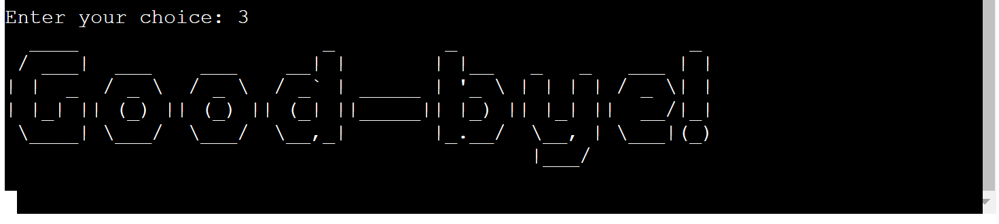

# 21 Blackjack Game
Welcome to the Customized Blackjack Game, a Python project created by Amaury Junior to practice programming skills. This game is inspired by Blackjack but includes some unique rules to make it a distinct gaming experience.

### Game Description

The Customized Blackjack Game is a command-line application that puts a spin on the traditional Blackjack game. It features modified rules for an engaging and challenging gameplay. [**Live Website: 21 Blackjack Game**](https://gameblackjack-a1c3e6bb9955.herokuapp.com/)

## User Experience (UX)

### New User

1. As a first-time user, I want to be able to start a game without having to read extensive rules.

2. If I encounter any issues or want to provide feedback, I'd like a way to contact the developer.

3. Most importantly, I want to have a fun and engaging experience!

### Returning User

1. As a returning user, I want to quickly start playing the game again.

2. I'd like to easily check if there have been any updates or changes to the game.

3. I'm here to have fun once more!

### Frequent User Goals

1. As a frequent user, my main goal is to continue enjoying the game.

2. I'll occasionally check for any updates or new features to enhance my experience.

3. The most important thing for me is to have an entertaining time playing!

## Game Flow

The game starts with the player receiving two cards. The objective is to reach 21 points or as close as possible without exceeding. If the player has less than 15 points, they are automatically required to draw more cards until they reach 15 points or more. Once 15 points or more are achieved, the player can choose to 'STAND' to keep their current score or 'HIT' to receive an additional card. Once the player finishes their turn, it's the dealer's turn. The dealer always 'HITs' until they reach 17 points or more. If the player or dealer exceeds 21 points, it is considered a 'BUST'. The winner of the round is determined based on who is closest to 21 points. The game consists of five rounds, and the player with the most wins at the end is declared the winner.

## Design Choices

The project aimed to create a terminal-based application with interactive and seamless transitions to provide an intuitive User Experience (UX). Visual elements were strategically incorporated to enhance user interaction and improve the game's visual appeal, as demonstrated in the Features section.

## Features

### Landing page

As part of the game, the 'Landing page' serves as the initial interface where players are greeted and introduced to the game. It features the game's logo, providing options for players to navigate through the menu.

### Game Rules

The 'Rules Page' (option 1 in the menu) offers players a concise overview of the game's mechanics, ensuring clear understanding and smoother gameplay. It provides essential information in an easy-to-follow format, enabling players to make informed decisions during matches.

### Exit

The farewell message (option 3 in the menu), thanks the player for their time and quit the game.

## Start Game

When choose 'Start Game' (option 2 in the menu). The player will be requested to enter a player's name.

After entering their name and pressing the player is greeted with a personalized welcome message.The game then commences, revealing the player's initial hand of two cards.

## Player's turn

If the player starts with less than 15 points, they will receive a prompt informing them to draw cards until they reach 15 points or more. Once achieved, they will be presented with an option to 'Stand' or 'Hit' for an additional card.

[Player Turn](docs/player_turn_01.png)

If the player chooses to 'Stand', they will be shown their final hand with all the cards.

[Player Final Hand](docs/player_turn_02.png)

However, if the player chooses to 'Hit' and subsequently busts (exceeds 21 points), their final hand will be displayed along with a message indicating the bust. The player will then be informed that it's the dealer's turn.

[Player Bust](docs/player_turn_03.png)

## Dealer's Turn

The dealer's hand is revealed. If the dealer has 17 points or more, they will stop and their final hand will be displayed

[Dealer's Hand](docs/dealer_tunr_01.png)

However, if the dealer starts with less than 17 points, they will automatically be required to draw another card until they reach 17 or more points.

[Dealer final Hand](docs/dealer_tunr_02.png)

Afterwards, the round's points are displayed, followed by a message defining the outcome of the round. Additionally, a message reveals the total number of rounds played so far and the current score for each player.

[Score Rounds](docs/score_rounds.png)