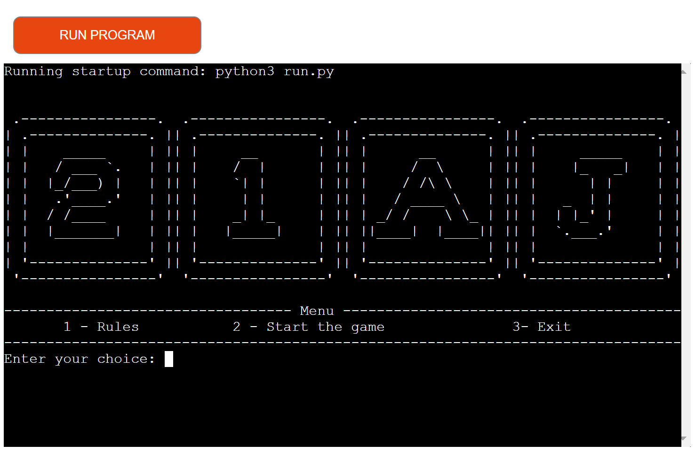
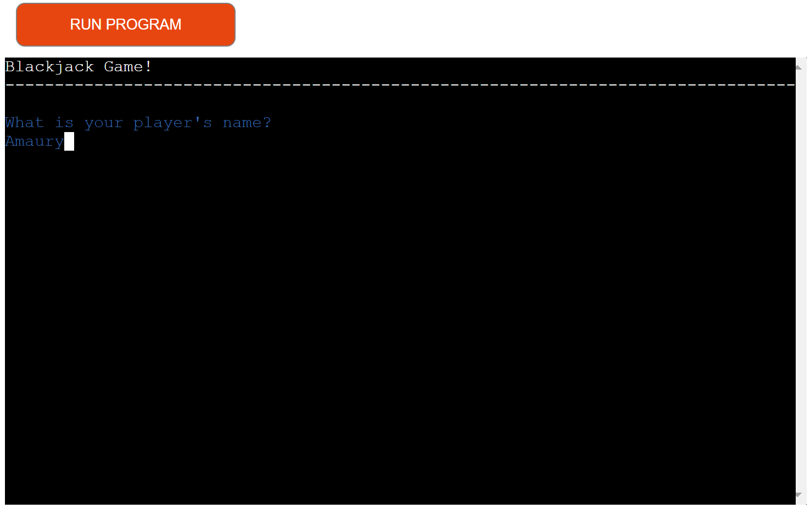

# 21 Blackjack Game
Welcome to the Customized Blackjack Game, a Python project created by Amaury Junior to practice programming skills. This game is inspired by Blackjack but includes some unique rules to make it a distinct gaming experience.

The Customized Blackjack Game is a command-line application that puts a spin on the traditional Blackjack game. It features modified rules for an engaging and challenging gameplay. 

[**Live Website: 21 Blackjack Game**](https://gameblackjack-a1c3e6bb9955.herokuapp.com/)

## User Experience (UX)

### New User

1. As a first-time user, I want to be able to start a game without having to read extensive rules.

2. If I encounter any issues or want to provide feedback, I'd like a way to contact the developer.

3. Most importantly, I want to have a fun and engaging experience!

### Returning User

1. As a returning user, I want to quickly start playing the game again.

2. I'd like to easily check if there have been any updates or changes to the game.

3. I'm here to have fun once more!

### Frequent User Goals

1. As a frequent user, my main goal is to continue enjoying the game.

2. I'll occasionally check for any updates or new features to enhance my experience.

3. The most important thing for me is to have an entertaining time playing!

## Game Flow

The game starts with the player receiving two cards. The objective is to reach 21 points or as close as possible without exceeding. If the player has less than 15 points, they are automatically required to draw more cards until they reach 15 points or more. Once 15 points or more are achieved, the player can choose to 'STAND' to keep their current score or 'HIT' to receive an additional card. Once the player finishes their turn, it's the dealer's turn. The dealer always 'HITs' until they reach 17 points or more. If the player or dealer exceeds 21 points, it is considered a 'BUST'. The winner of the round is determined based on who is closest to 21 points. The game consists of five rounds, and the player with the most wins at the end is declared the winner.

## Design Choices

The project aimed to create a terminal-based application with interactive and seamless transitions to provide an intuitive User Experience (UX). Visual elements were strategically incorporated to enhance user interaction and improve the game's visual appeal, as demonstrated in the Features section.

## Features

### Landing page

As part of the game, the 'Landing page' serves as the initial interface where players are greeted and introduced to the game. It features the game's logo, providing options for players to navigate through the menu.

### Game Rules

The 'Rules Page' (option 1 in the menu) offers players a concise overview of the game's mechanics, ensuring clear understanding and smoother gameplay. It provides essential information in an easy-to-follow format, enabling players to make informed decisions during matches.

### Start Game

When choose 'Start Game' (option 2 in the menu). The player will be requested to enter a player's name.

After entering their name and pressing the player is greeted with a personalized welcome message.The game then commences, revealing the player's initial hand of two cards.

### Player's turn

If the player starts with less than 15 points, they will receive a prompt informing them to draw cards until they reach 15 points or more. Once achieved, they will be presented with an option to 'Stand' or 'Hit' for an additional card.

[Player Turn](docs/player_turn_01.png)

If the player chooses to 'Stand', they will be shown their final hand with all the cards.

[Player Final Hand](docs/player_turn_02.png)

However, if the player chooses to 'Hit' and subsequently busts (exceeds 21 points), their final hand will be displayed along with a message indicating the bust. The player will then be informed that it's the dealer's turn.

[Player Bust](docs/player_turn_03.png)

### Dealer's Turn

The dealer's hand is revealed. If the dealer has 17 points or more, they will stop and their final hand will be displayed

[Dealer's Hand](docs/dealer_tunr_01.png)

However, if the dealer starts with less than 17 points, they will automatically be required to draw another card until they reach 17 or more points.

[Dealer final Hand](docs/dealer_tunr_02.png)

Afterwards, the round's points are displayed, followed by a message defining the outcome of the round. Additionally, a message reveals the total number of rounds played so far and the current score for each player.

[Score Rounds](docs/score_rounds.png)

### Final Winner Message

Once the five rounds are completed, a summary is presented, showcasing the total number of rounds played. Following this, the final results are revealed, declaring the champion based on the number of rounds won or announcing a tie if both players have an equal number of victories.

[Final Result](docs/final_result_winner.png)

### Final Message to the User

Wrap up the game with a personalized thank-you message. Players are encouraged to share feedback or report any issues via the provided email address. Decide whether to play another round using the menu below.

[Final Message to the User](docs/final_message.png)

### Exit

The farewell message (option 3 in the menu), thanks the player for their time and quit the game.

[Good Bye Message](docs/good_bye.png)

## Testing

Testing was a crucial phase in the development process. I thoroughly examined every aspect of the application to ensure seamless functionality and user-friendly interactions.
Extensive terminal-based testing was employed to detect and rectify potential issues. We ran multiple scenarios, testing both correct and incorrect user inputs, to guarantee the application responds appropriately in various situations.

### Manual Testing

Thorough testing was conducted to verify accuracy of the application. Manual tests were performed to cover various scenarios, and screenshots were taken to document the results.

1. Menu Input Hangdling : In the main menu, providing an invalid option, triggered an appropriate error message.

Attempting to use:

    - e.g., entering '4' - [Menu Input Handling](docs/manual_testing_01.png)
    - e.g., entering 'space' - [Menu Input Handling](docs/menu_handling_03.png)
    - e.g., entering 'letter' - [Menu Input Handling](docs/menu_handling_02.png)
    - e.g., entering ' ' - [Menu Input Handling](docs/manual_testing_04.png)
    - e.g., entering '=' - [Menu Input Handling](docs/menu_handling_05.png)

2. Player Name Validation : Testing input for the player's name revealed that the application correctly accepts only alphabetic characters. Attempting to use numbers resulted in an error message.

Attempting to use: Numbers, letter with number, blank space, special character.

    -[Player Name Validation](docs/manual_testing_02.png)

3. Player Lenght Limit: A test was conducted to ensure that the application enforces a maximum character limit of 15 for player name. Any input exceeding this limit triggered an error.

    - [Player Lenght Limit](docs/manual_testing_03.png)

4. Invalid Choice Handling : When prompted to choose 'stand' (s) or 'hit' (h), entering any other character produced an expected error message.

    - [Invalid Choice Handling](docs/manual_testing_04.png)

These tests were conducted to ensure that the application handles user input effectively and provides clear feedback in case of erroneous entries.

In addition to manual testing, automated checks were performed using the PEP8 checker tool (https://pep8ci.herokuapp.com/) to ensure adherence to coding standards and practices.

1. [Run.py file](docs/run_validation.png)

2. [Gameplay.py file](docs/gamplay_validation.png)

3. [Deck.py file](docs/deck_validation.png)

4. [Messages.py file](docs/messages_validation.png)

5. [Utilities.py file](docs/utilities_validation.png)

## Bugs and Issues

Debugging and troubleshooting were integral parts of the development process. Constant attention was given to identifying and resolving potential issues to ensure a smooth user experience.

The codebase was thoroughly checked using the PEP8 checker tool (https://pep8ci.herokuapp.com/). It initially flagged several warnings related to formatting and whitespace. However, diligent efforts were made to address each of these concerns. As a result, all warnings were rectified, resulting in a clean codebase with zero warnings across all files.

Throughout the development process, rigorous testing and debugging were conducted to ensure the application's reliability. Multiple playthroughs were undertaken to assess the game's performance, and I'm pleased to report that no apparent errors or issues were encountered. The game ran smoothly and consistently, providing a seamless and enjoyable experience for users. This extensive testing process instills confidence in the application's stability and functionality.

- Addressed Concern

In the course of developing the game, a specific scenario was encountered where a player could initially start with 22 points, denoted by two Aces. To address this, an initial conditional check was implemented: [initial conditional](docs/conditional.png).

After extensive testing, it was observed that this situation could arise, leading to a potential error: [AttributeError](docs/attributeError.png)

Subsequently, a solution was implemented by adding the shuffle method to the Deck class: [Shuffle Method](docs/def_shuffle.png)

It is worth noting that extensive testing has been conducted, and up to the present moment, no further occurrences of this error have been observed. However, due to the random nature of the cards, it is not possible to definitively verify the resolution.

## Technologies Used

 This project was developed using Python.

Here are the libraries utilized in this project:

1.  : Was crucial for obtaining cards randomly and for shuffling if necessary during game development.

2.  : Employed for introducing pauses and controlling the pacing of the game, enhancing the User Experience.

3.  : This library provides an easy way to add colored output to the terminal, making the game more visually appealing and informative for better UX.

4.  : Utilized for creating stylish text-based graphics and logos, adding an aesthetic touch to the game's interface, enhancing the User Experience.

5.  : This library provides functions to interact with the operating system, allowing for tasks like clearing the terminal screen during gameplay for better UX.

Each of these libraries played a key role in enhancing the functionality and visual appeal of the Blackjack game.

### Tools

1.  : Served as the version control repository, facilitating collaboration and code management.

2.  : Was utilized as the integrated development environment (IDE) and code editor, providing a seamless coding experience.

3.  : Using for deployment, to make the application accessible online.

4.  : To ensure code quality and adherence to best practice and to detect and address any potential errors or issues

5.  : Was used to create a flowchart, enhancing the project's documentation and readability.

6.  : was employed, offering essential files to simulate a terminal environment directly in the browser.

7.  : Used to add images as badges in the README.

## Media

### Study Resources:

1. [Python Tutor](https://pythontutor.com/visualize.html#mode=edit) - Used for code visualization and analysis.
2. [YouTube Tutorial: Python Menu](https://www.youtube.com/watch?v=yFopU1ESCcQ) - Demonstrated creating a menu in Python.
3. Code Institute Course Lectures
4. [W3Schools Python Section](https://www.w3schools.com/python)
5. [YouTube Tutorial:](https://www.youtube.com/watch?v=mpL0Y01v6tY)
6. [Python Channel on Youtube:](https://www.youtube.com/@coreyms)
7. [Code Review Stack Exchange: Blackjack Implementation](https://codereview.stackexchange.com/questions/85751/implement-blackjack-in-python-with-oop)
8. [Stack Overflow](https://stackoverflow.com/): This platform was frequently visited for troubleshooting and seeking solutions to coding challenges.
9. [PEP 8](https://peps.python.org/pep-0008/)

## Deployment

GitHub Deployment

1 - GitHub Account: Begin by creating an account on github.com. The platform is free to use.

2 - Repository Creation: Create a repository to host your website. Click the "+" button on the main page, then select "New Repository."

3 - Repository Details: Provide a name, description, and set it to public.

4 - Access Repository Settings: Navigate to the repository settings.

5 - GitHub Pages Section: Locate this section within the settings.

6 - Branch Selection: Choose the "main" branch for deployment.

7 - Save Changes: Save the settings to initiate the deployment process.

8 - Deployment in Progress: Wait for the confirmation message indicating successful deployment.

9 - Accessing the Live Site: Retrieve the link to your deployed website.

10 - Share the Link: Share the provided link with others.

Explore the Deployed Website: Visit the live site by clicking on the following link: [Live Website: 21 Blackjack Game](https://gameblackjack-a1c3e6bb9955.herokuapp.com/)

Heroku Deployment

1 - Create an account on Heroku.

2 - Create a new app.

3 - Choose your location.

4 - Click on "Create app."

5 - Navigate to "Settings."
- Configure environment variables and click "Add."
- create a config var called PORT. Set to 8000.
- Add buildpacks to your application:
- Add Python buildpack.
- Enter python and save changes.
- Add Node.js buildpack.
- Enter nodejs and save changes.

6 - Go to "Deploy."
7 - Select GitHub.

- Connect to your GitHub repository.
- Search for the repository and connect.

8 - Deploy the branch manually.

9 - Once the deployment process is complete, click "View" to access your deployed application.

Explore the Deployed Website: Visit the live site by clicking on the following link: [Live Website: 21 Blackjack Game](https://gameblackjack-a1c3e6bb9955.herokuapp.com/)

## Credit

1. [YouTube Tutorial:](https://www.youtube.com/watch?v=mpL0Y01v6tY) - I gained a general idea of what I needed to create a blackjack game.

2. [Python Channel on Youtube:](https://www.youtube.com/@coreyms) - This channel helped me with various questions and was crucial for understanding some of the topics implemented in the project.

3. [YouTube Tutorial: Python Menu](https://www.youtube.com/watch?v=yFopU1ESCcQ) - Demonstrated creating a menu in Python.

## Acknowledgments

A special thanks to my mentor [Matt Bodden](https://github.com/MattBCoding) whose insights and advice were instrumental in bringing this project to completion. Your guidance made all the difference.